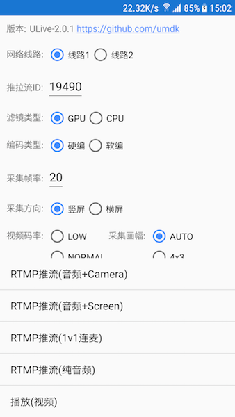
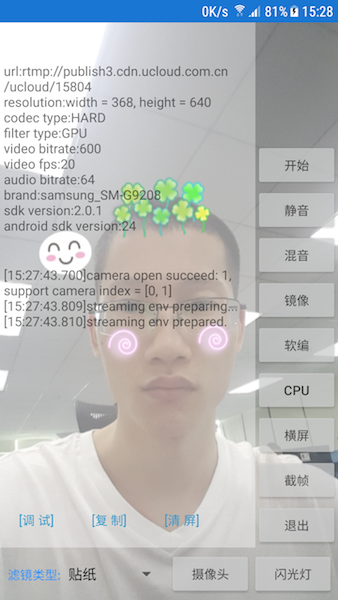
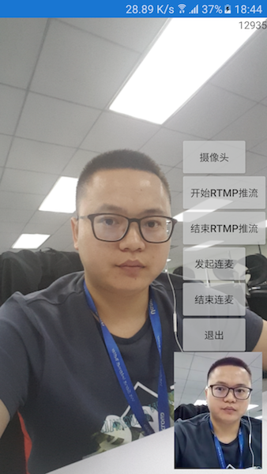

# UCloud 直播云 SDK 文档

UCDLive SDK 是由 UCloud 提供的低延时、高并发的直播云服务。

  
  
  

- 1 [阅读对象](#1)
- 2 [功能特性](#2)
- 3 [开发准备](#3)
    - 3.1 [开发环境配置](#3.1)
    - 3.2 [设备 & 系统](#3.2)
    - 3.3 [混淆说明](#3.3)
- 4 [快速开始](#4)
    - 4.1 [运行 Demo 源码](#4.1)
    - 4.2 [项目集成 SDK](#4.2)
        - step 1: [导入 SDK 库，并添加依赖](#4.2.1)
        - step 2: [初始化 SDK 环境，并添加权限](#4.2.2)
        - step 3: [添加界面元素](#4.2.3)
        - step 4: [创建推流对象，并进入准备状态](#4.2.4)
        - step 5: [启动预览](#4.2.5)
        - step 6: [启动推流](#4.2.6)
- 5 [功能使用](#5)
    - [状态获取](#5.1)
    - [参数设置](#5.2)
    - [摄像头操作](#5.3)
    - [视频滤镜](#5.4)
        - [美颜滤镜](#5.4.1)
        - [滤镜组](#5.4.2)
        - [GPUImage (android-gpuimage)](#5.4.3)
        - [自定义滤镜](#5.4.4)
        - [贴图使用](#5.4.5)
    - [音频滤镜](#5.5)
- 6 [播放器集成](#6)
- 7 [反馈和建议](#7)
- 8 [版本历史](#8)

<a name="1"></a>
# 1 阅读对象

本文档面向开发人员、测试人员、合作伙伴及对此感兴趣的其他用户，使用该 SDK 需具备基本的 Android 开发能力。

<a name="2"></a>
# 2 功能特性

- 支持音视频硬编(H.264 & AAC)
- 支持 RTMP 封包 & 推流
- 支持5种清晰度切换
    1. 自动 (根据屏幕大小自动设定)
    2. 640 * 480 (4:3)
    3. 320 * 180 (16:9 Low)
    4. 640 * 360 (16:9 Normal)
    5. 1280 * 720 (16:9 High)
- 支持前、后置摄像头动态切换
- 支持推流横、竖屏动态切换
- 支持滤镜模式(CPU & GPU)动态切换
- 支持视频镜像、非镜像操作
- 支持静音操作
- 支持闪关灯操作
- 支持自动对焦
- 支持截帧操作
- 支持美颜滤镜(磨皮、美白、红润)，可设置5种效果等级
- 支持动态贴纸(Faceu等)
- 支持自定义滤镜，兼容GPUImage
- 支持音视频源数据回调，可自定义数据处理
- 支持 armv7a、arm64-v8a 主流芯片体系架构
- 支持 RTMP 推流地址鉴权功能
- 支持云适配功能
- 支持直播鉴黄功能
- 支持混音效果
- 支持 ip 推流

<a name="3"></a>
# 3 开发准备

<a name="3.1"></a>
## 3.1 开发环境配置

- Android Studio开发工具。官方[下载地址](https://developer.android.com/studio/index.html)
- 下载UCDLive SDK。
- 请用真机调试代码，模拟器无法调试。

<a name="3.2"></a>
## 3.2 设备 & 系统

- 设备要求：搭载 Android 系统的设备
- 系统要求：Android 4.3+ (API 18+)

<a name="3.3"></a>
## 3.3 混淆说明

为保证正常使用 SDK ，请在 proguard-rules.pro 文件中添加以下代码：

```
-keep class com.ucloud.** { *; } 
```

<a name="4"></a>
# 4 快速开始

您可以选择以下两种开始方式，直接运行Demo源码，或者集成 SDK 到已有项目。

<a name="4.1"></a>
## 4.1 运行 Demo 源码

打开 Android Studio 菜单 File -> New -> Import Project，选择并指向 SDK 的解压目录，然后点击 OK。若出现库找不到编译失败，更新相应的 SDK 即可。

<a name="4.2"></a>
## 4.2 项目集成 SDK

<a name="4.2.1"></a>
### step 1: 导入 SDK 库，并添加依赖

打开 Android Studio 菜单 File -> New -> Import Module，选择并指向 SDK 解压目录下的 ulive-android-sdk 目录，然后点击 finish。

在 settings.gradle 添加以下代码：

```
include ':ulive-android-sdk'
```

在 build.gradle 添加以下代码：

```
dependencies {
    ...
    compile project(':ulive-android-sdk')
    ...
}
```
    
> 【小细节】  
> 请确保使用的 Android SDK API 版本是4.3以上，即 minSdkVersion >= 18

<a name="4.2.2"></a>
### step 2: 初始化 SDK 环境，并添加权限

建议您新建 MyApplication 类，并初始化 SDK 环境

```
public class MyApplication extends Application {

    @Override
    public void onCreate() {
        super.onCreate();
        UStreamingContext.init(getApplicationContext(), "accessKey");
    }
}
```

> 【小细节】  
> accessKey 用于推流鉴权，demo中的推流域名只能供测试使用，如需更换推流域名，请[发邮件给我们](#7)进行授权。

使用该 SDK 需在 Androidmainfets.xml 中添加以下权限：

```
<!-- common -->
<uses-permission android:name="android.permission.INTERNET" />
<uses-permission android:name="android.permission.WRITE_EXTERNAL_STORAGE" />
<uses-permission android:name="android.permission.WAKE_LOCK" />
<uses-permission android:name="android.permission.READ_PHONE_STATE" />
<uses-permission android:name="android.permission.ACCESS_NETWORK_STATE" />
<uses-permission android:name="android.permission.ACCESS_WIFI_STATE" />

<!-- for live -->
<uses-permission android:name="android.permission.RECORD_AUDIO" />
<uses-permission android:name="android.permission.CAMERA" />
<uses-feature android:name="android.hardware.camera.autofocus" />
<uses-feature android:glEsVersion="0x00020000" android:required="true" />
```

<a name="4.2.3"></a>
### step 3: 添加界面元素

为了能够展示推流预览界面，您需要使用 TextureView 进行预览，并添加 SurfaceTextureListener：

```
TextureView mTexturePreview = new TextureView(this);
mTexturePreview.setKeepScreenOn(true);
mTexturePreview.setSurfaceTextureListener(this);
```

> 【小细节】  
> 如果您想要调整预览界面模式比例，建议您使用 UAspectFrameLayout 作为 TextureView 的父容器，具体代码可参照Demo示例

<a name="4.2.4"></a>
### step 4: 创建推流对象，并进入准备状态

先创建一个 UEasyStreaming 对象，它是所有 SDK 调用接口的承载者，并进入准备状态

```
UEasyStreaming mEasyStreaming = UEasyStreaming.Factory.newInstance();
String mRtmpAddress = "rtmp://xxx";
UStreamingProfile mStreamingProfile = new UStreamingProfile.Builder().build(mRtmpAddress);
mEasyStreaming.prepare(mStreamingProfile);
```
> 【小细节】  
> SDK 支持 ip 推流，格式如下：  
> rtmp://127.0.0.1/ucloud/%s?host=publish3.cdn.ucloud.com.cn

UStreamingProfile 为参数设置类，可设置类型包括音频、视频、摄像头、滤镜，具体内容参考[参数设置](#5.2)。

<a name="4.2.5"></a>
### step 5: 启动预览

在 SurfaceTextureListener 的 onSurfaceTextureAvailable 回调中，添加以下代码启动预览：

```
@Override
public void onSurfaceTextureAvailable(SurfaceTexture surface, int width, int height) {
    mEasyStreaming.startPreview(surface, width, height);
}
```

<a name="4.2.6"></a>
### step 6: 启动推流

在mEasyStreaming.prepare()之后，添加以下代码启动推流：

```
mEasyStreaming.startRecording();
```

<a name="5"></a>
# 5 功能使用

**UEasyStreaming** 是整个 SDK 的核心类，是所有调用接口的承载者，以下介绍的所有功能都在其中进行。

<a name="5.1"></a>
## 状态获取

如果您希望获取 SDK 内部状态，您可以通过向 UEasyStreaming 对象设置 Listener 来获取，目前我们支持以下三种状态类型的获取：

```
mEasyStreaming.setOnStreamStateListener(this);
mEasyStreaming.setOnNetworkStateListener(this);
mEasyStreaming.setOnCameraSessionListener(this);
```

- 推流状态返回

|状态枚举|描述|
|---|---|
|UStreamStateListener.State.PREPARING|推流初始化准备中|
|UStreamStateListener.State.PREPARED|推流初始化完毕|
|UStreamStateListener.State.CONNECTING|正在于服务器建立连接中|
|UStreamStateListener.State.CONNECTED|与服务器成功建立连接|
|UStreamStateListener.State.START|推流开始|
|UStreamStateListener.State.STOP|推流停止|
|UStreamStateListener.State.NETWORK\_BLOCK|弱网等情况下丢帧|
|UStreamStateListener.Error.INVALID\_STREAMING\_URL|非法的推流地址|
|UStreamStateListener.Error.SIGNATRUE\_FAILED|推流地址鉴权出错|
|UStreamStateListener.Error.AUDIO\_PREPARE\_FAILED|音频准备出错|
|UStreamStateListener.Error.VIDEO\_PREPARE\_FAILED|视频准备出错|
|UStreamStateListener.Error.IOERROR|推流出现IO流读写错误，可能与服务器断开了连接|
|UStreamStateListener.Error.UNKNOWN|推流出现未知错误|

- 摄像头状态返回

|状态枚举|描述|
|---|---|
|UCameraSessionListener.Error.START\_PREVIEW\_FAILED|摄像头预览失败|
|UCameraSessionListener.Error.REQUEST\_FLASH\_MODE\_FAILED|打开摄像头闪关灯失败|
|UCameraSessionListener.Error.NO\_NV21\_PREVIEW\_FORMAT|摄像头不支持NV21预览格式|
|UCameraSessionListener.Error.NO\_SUPPORT\_PREVIEW\_SIZE|摄像头不支持预览大小|
|UCameraSessionListener.Error.NO\_PERMISSION|缺少摄像头访问权限|
|UCameraSessionListener.Error.UNKNOWN|摄像头出现未知错误|

- 网络状态返回

|状态枚举|描述|
|---|---|
|UNetworkListener.State.NETWORK\_SPEED|获取当前发送速度|
|UNetworkListener.State.PUBLISH\_STREAMING\_TIME|获取当前推流时长|
|UNetworkListener.State.DISCONNECT|网络连接断开|
|UNetworkListener.State.RECONNECT|网络连接重连|

<a name="5.2"></a>
## 参数设置

如果您希望自定义参数，您可以通过向 UEasyStreaming 对象设置 Profile 来实现，目前我们支持以下四种Profile类型设置：

- UVideoProfile：视频参数设置

|参数名|描述|默认值|
|:---:|---|:---:|
|fps|视频帧率：即视频编码器每秒生产出多少帧画面，注意由于大部分安卓机器摄像头不支持30fps以上的采集，推荐您设置fps为20|20|
|bitrate|视频码率：即视频编码器每秒生产出多少数据（单位：kbps）|VIDEO\_BITRATE\_NORMAL (400)|
|resolution|视频分辨率：目前提供五种分辨率可供您选择，具体参考UVideoProfile.Resolution|Resolution.RATIO\_AUTO|
|captureOrientation|设置视频图像旋转角度，比如是否要横屏推流|ORIENTATION\_PORTRAIT (1)|
|iframeInterval|关键帧间隔: 即多少秒出一个I帧（单位：秒）|2|

- UAudioProfile：音频参数设置

|参数名|描述|默认值|
|:---:|---|:---:|
|bitrate|音频码率：即音频编码器每秒生产出多少数据（单位：kbps）|128|
|samplerate|音频采样率：录音设备在一秒钟内对声音信号的采集次数|44100|
|channels|音频采集声道数|2|

- UCameraProfile：摄像头参数设置

|参数名|描述|默认值|
|:---:|---|:---:|
|frontCameraFlip|前置摄像头推流是否需要镜像|false|
|setCameraIndex|需要打开摄像头的index|CAMERA\_FACING\_FRONT|

- UFilterProfile：滤镜参数设置

|参数名|描述|默认值|
|:---:|---|:---:|
|mode|设置使用的滤镜模式（GPU、CPU）|FilterMode.GPU|

<a name="5.3"></a>
## 摄像头操作

如果您希望操作摄像头，我们提供了以下方法：

- **切换前、后置摄像头**：默认是使用前置摄像头，调用一次 switchCamera 切换一次, 该接口需在启动预览之后调用，并返回操作结果

    ```
    boolean isSuccess = mEasyStreaming.switchCamera();
    ```
    
- **打开、关闭闪光灯** : 只有后置摄像头才可以打开闪光灯，该接口需在启动预览之后调用，并返回操作结果

    ```
    boolean isSuccess = mEasyStreaming.toggleFlashMode();
    ```
    
- **截帧**：注册 UScreenShotListener 监听器，回调返回Bitmap

    ```
    mEasyStreaming.takeScreenShot(new UScreenShotListener() {
    
        @Override
        public void onScreenShotResult(Bitmap bitmap) {
            // ...
        }
    });
    ```

<a name="5.4"></a>
## 视频滤镜

这边我们提供了两种滤镜基类，所有使用的滤镜都需继承自它们

- **UVideoGPUFilter**：GPU 滤镜基类
- **UVideoCPUFilter**：CPU 滤镜基类

> 【注意】  
> 以下滤镜示例代码如无特别说明，将以 GPU 滤镜为例。

<a name="5.4.1"></a>
### 美颜滤镜

如果您在直播过程中需要用到美颜效果，我们提供了 USkinBeautyGPUFilter 和 USkinBeautyCPUFilter 两种默认简单实现，当然您也可以参考[自定义滤镜](#5.4.4)部分实现您自己的美颜滤镜。

另外，GPU美颜滤镜支持**磨皮**、**美白**、**红润**三种效果等级调节，添加示例代码如下：

```
USkinBeautyGPUFilter mSkinBeautyGPUFilter = new USkinBeautyGPUFilter();
// level1: 磨皮；level2: 美白；level3: 红润；
mSkinBeautyGPUFilter.setFilterLevel(level1, level2, level3);
mEasyStreaming.setVideoGPUFilter(mSkinBeautyGPUFilter);
```

<a name="5.4.2"></a>
### 滤镜组

如果您希望叠加使用多种滤镜效果，我们提供了 UVideoGroupGPUFilter 滤镜组功能，示例代码如下：

```
List<UVideoGPUFilter> filters = new ArrayList<>();

USkinBeautyGPUFilter mSkinBeautyGPUFilter = new USkinBeautyGPUFilter();
mSkinBeautyGPUFilter.setFilterLevel(level1, level2, level3);
filters.add(mSkinBeautyGPUFilter);

USkinBlurGPUVideoFilter mSkinBlurGPUVideoFilter = new USkinBlurGPUVideoFilter(2);
filters.add(mSkinBeautyGPUFilter);

UVideoGroupGPUFilter mGpuGroupFilter = new UVideoGroupGPUFilter(filters);
mEasyStreaming.setVideoGPUFilter(mGpuGroupFilter);
```

<a name="5.4.3"></a>
### GPUImage (android-gpuimage)

如果您希望使用android-gpuimage，我们提供了兼容类GPUImageCompat，只需将滤镜继承的父类GPUImageFilter替换成GPUImageCompat即可，注意添加GPUImage依赖

```
dependencies {
    ...
    compile 'jp.co.cyberagent.android.gpuimage:gpuimage-library:1.4.1'
    ...
}
```

<a name="5.4.4"></a>
### 自定义滤镜

如果您希望自定义GPU滤镜，需继承 UVideoGPUFilter 类，并重写以下方法，具体写法可参考 Demo 中的 WhiteningGPUVideoFilter 滤镜。

```
@Override
public void onInit(int VWidth, int VHeight) {
    super.onInit(VWidth, VHeight);
}

@Override
public void onDraw(int cameraTexture, int targetFrameBuffer, 
        FloatBuffer shapeBuffer, FloatBuffer textrueBuffer) {
    
    GLES20.glBindFramebuffer(GLES20.GL_FRAMEBUFFER, targetFrameBuffer);
    // your draw code
    GLES20.glBindFramebuffer(GLES20.GL_FRAMEBUFFER, 0);
}

@Override
public void onDirectionUpdate(int _directionFlag) {
    super.onDirectionUpdate(_directionFlag)
}
    
@Override
public void onDestroy() {
    super.onDestroy();
}
```

- onInit：进行初始化操作，宽高的初始化等
- onDraw：进行绘制操作
    - cameraTexture：输入图像
    - targetFrameBuffer：输出位置
    - shapeBuffer：绘制的矩阵
    - textrueBuffer：需要使用图像的哪一部分作为输入
- onDestroy：进行资源回收销毁操作
- onDirectionUpdate：更新绘制方向

其中，绘制开始前需绑定FrameBuffer，绘制结束后需解绑。

另外，您也可以继承自 UBaseVideoGPUFilter 类，具体写法可参考 Demo 中的 ColorMixGPUFilter 滤镜。

如果您希望自定义CPU滤镜，需继承 UVideoCPUFilter 类，并重写以下方法，具体写法可参考 Demo 中的 GrayCPUFilter 滤镜。

```
@Override
public void onInit(int VWidth, int VHeight, int colorForamt) {
    super.onInit(VWidth, VHeight, colorFormat);
}

@Override
public boolean onFrame(byte[] orignBuff, byte[] targetBuff, 
        long presentationTimeMs, int sequenceNum) {
    
    System.arraycopy(orignBuff,0,targetBuff,0,SIZE_Y);
    for (int i = SIZE_Y; i < SIZE_TOTAL; i++) {
        targetBuff[i] = 127;
    }
    return true;
}

@Override
public void onDestroy() {
    super.onDestroy();
}
```

- onInit：进行初始化操作，宽高、像素格式的初始化等
    - colorFormat: 目前支持2种格式，ImageFormat.NV21 & ImageFormat.YV12
- onFrame：进行滤镜操作，返回 false 表示使用 orignBuff，返回 true 表示使用 targetBuff
    - orignBuff：输入图像
    - targetBuff：输出图像
    - presentationTimeMs：时间戳
    - sequenceNum：图像序列
- onDestroy：进行资源回收销毁操作

<a name="5.4.5"></a>
### 贴图使用

如果您在直播过程中需要用到贴图效果，我们提供了方便的接入流程，这边以 Faceu 为例介绍接入流程，具体写法可参照 Demo 中的 FaceuCompat 类。

贴图可以看做是一种特殊的滤镜，其绘制流程可参考[自定义滤镜](#5.4.4)。

Faceu 贴图步骤：

- step 1: 获取帧数据

    通过 UCameraSessionListener.onPreviewFrame() 回调，获取摄像头帧数据 data
    
    ```
    @Override
    public void onPreviewFrame(int cameraId, byte[] data, int width, int height) {
        mFaceuCompat.updateCameraFrame(cameraId, data, width, height);
    }
    ```
    
- step 2: 人脸识别

    调用 IFaceDetector.onFrameAvailable() 方法将数据传入 IFaceDetector 进行人脸识别
    
    ```
    public void updateCameraFrame(int cameraId, final byte[] data, int width, int height) {
        try {
            if (mCameraId != cameraId) {
                mRotation = getRotation(cameraId);
                mCameraId = cameraId;
                isVerticalFlip = mCameraId == Camera.CameraInfo.CAMERA_FACING_FRONT;
            }
            if (null != mFaceDetector && null != mDirectionDetector) {
                mFaceDetector.onFrameAvailable(width, height, mRotation, isVerticalFlip, 
                    data, mDirectionDetector.getDirection());
            }
        }catch (Exception e) {
            e.printStackTrace();
        }
    }
    ```
        
- step 3: 获取人脸坐标

    调用 IFaceDetector.getFaceDetectResult() 获取识别到的人脸数 faceCount，然后调用 GPUImageFilterGroupBase.setFaceDetResult()设置识别结果

    ```
    int faceCount = mFaceDetector.getFaceDetectResult(mFaceDetectResultList, SIZE_WIDTH, 
            SIZE_HEIGHT, SIZE_WIDTH, SIZE_HEIGHT);
    mFaceuFilter.setFaceDetResult(faceCount, mFaceDetectResultList, SIZE_WIDTH, SIZE_HEIGHT);
    ```
    
- step 4: 绘制贴图
    
    在 UVideoGPUFilter 的 onDraw 方法中，调用 GPUImageFilterGroupBase.draw()绘制贴图
    
    ```
    @Override
    public void onDraw(int cameraTexture, int targetFrameBuffer, 
            FloatBuffer shapeBuffer, FloatBuffer textrueBuffer) {
        ...
        GLES20.glBindFramebuffer(GLES20.GL_FRAMEBUFFER, targetFrameBuffer);
        mFaceuFilter.draw(cameraTexture, targetFrameBuffer, mGLCubeBuffer, mGLTextureBuffer);
        GLES20.glBindFramebuffer(GLES20.GL_FRAMEBUFFER, 0);
        ...
    }
    ```

<a name="5.5"></a>
## 音频滤镜

如果您在直播过程中需要用到音频滤镜效果，我们目前提供了静音以及混音效果，后面会陆续补充添加。静音使用代码如下：

```
mEasyStreaming.setAudioCPUFilter(new AudioMuteFilter());
```

> 【小细节】  
> 混音效果请参照 Demo 中的 URawAudioMixFilter

如果您希望自定义GPU滤镜，需继承 UAudioCPUFilter 类，并重写以下方法即可，具体写法可参考 Demo 中的 AudioMuteFilter 滤镜。

```
@Override
public void onInit(int size) {
    super.onInit(size);
    SIZE = size;
    SIZE_HALF = size/2;
}
    
@Override
public boolean onFrame(byte[] orignBuff, byte[] targetBuff, 
        long presentationTimeMs, int sequenceNum) {
    
    for (int i = 0; i < SIZE; i++) {
        orignBuff[i] = 0;
    }
    return false;
}

@Override
public void onDestroy() {
    super.onDestroy();
}
```

- onInit：进行初始化操作，大小初始化等
- onFrame：进行滤镜操作，返回 false 表示使用 orignBuff，返回 true 表示使用 targetBuff
    - orignBuff：输入音频数据
    - targetBuff：输出音频数据
    - presentationTimeMs：时间戳
    - sequenceNum：音频数据序列
- onDestroy：进行资源回收销毁操作

<a name="6"></a>
# 6 播放器集成
详细请参考[UCDMediaPlayer项目](https://github.com/umdk/UCDMediaPlayer_Android)。

<a name="7"></a>
# 7 反馈和建议
  - 主 页：<https://www.ucloud.cn/>
  - issue：[查看已有的 issues 和提交 Bug[推荐]](https://github.com/umdk/UCDLive_Android/issues)
  - 邮 箱：[sdk_spt@ucloud.cn](mailto:sdk_spt@ucloud.cn)

<a name="8"></a>
# 8 版本历史

* v1.4.2 (2016.11.09)
    - 优化丢帧策略

* v1.4.1 (2016.11.03)
    - 增加ip推流支持
    - 优化云适配

* v1.4.0 (2016.10.25)
    - 功能模块拆分、解耦，增加外部使用可以操作自由度

* v1.3.6 (2016.09.28)
    - 播放器增加FCSubscribe播放指令支持

* v1.3.5 (2016.09.01)
    - 增加arm64-v8a,armeabi架构的so库
    
* v1.3.3 (2016.08.18)
    - 增加mute接口推流时禁掉音频
    - 硬编输出视频大小新增320x180小分辨率
    - 软编推流概率性失败问题修复
    
* v1.3.2 (2016.08.18)
    - 修复摄像头打开失败后返回值错误
    - 修复MSG_PREVIEWD,MSG_START_RECORDING切到后台,重新切回时没有调用错误
    
* v1.3.1 (2016.07.20)
    - 增加断网重连支持
    - camera预设指定
    - 参数reset操作
    - 丰富推流状态回调接口
    - 稳定性优化
    
* v1.2.9 (2016.06.28)
    - 优化美颜滤镜算法
    - 新增美颜级别设置接口
    - 稳定性优化
    - bug修复
    
* v1.2.9 (2016.06.28)
    - 优化美颜滤镜算法
    - 新增美颜级别设置接口
    - 稳定性优化
    - bug修复 
       
* v1.2.8 (2016.06.24)
    - 新增磨皮滤镜level设置接口UEasyStreaming.applyFilterLevel(float,float,float,float);
每个参数的值推荐范围为1-100
    
* v1.2.7 (2016.06.20)
    - 优化美白磨皮滤镜效果
     
* v1.2.6 (2016.06.03)
    - 优化播放器,推流画面重叠的问题
    
* v1.2.5 (2016.05.26)
    - 新增云适配功能
    - support播放器播放时叠加  
    - 为避免混淆使用，彻底删除UStreamingProfile当中过时的setVideoEncodingWidth/Height方法，该方法一致使用setVideoCaptureWidth/Height方法替换
    - 滤镜支持可选通过applyFilter(int)方法可传递
     
* v1.2.4 (2016.05.23)
    - 统一软硬编码传参接口
    - 新增横竖屏切换模式指定
    - 新增音频bitrate设置接口
    
* v1.2.3 (2016.04.22)
    - 优化软编音质问题,降低了滤镜算法，掉帧情况好转
    
* v1.2.2 (2016.04.19)
    - UEasyStreaming删除setSurfaceView(..)、setSurfaceHolder(..)接口
  用setAspectWithStreamingProfile(UAspectFrameLayout, UStreamingProfile);替换
  老版本接入需要在live_layout_live_room_view.xml中修改为com.ucloud.live.widget.UAspectFrameLayout.  
     
* v1.2.1 (2016.04.13)
    - 修复概率性crash,
	- sdk增加了prepare失败以及成功的回调接口
	- 增加了device brand,sdk version, android sdk version的屏幕显示方便客户问题定位。
	- 增加了对网络不稳定时的次数统计，并输出在屏幕，方便客户了解自己推流时网络波动情况
	- 统一规范sdk native层的日志输出。
            
* v1.2.0 (2016.05.23)
    - 统一软硬编码传参接口
    - 新增横竖屏切换模式指定
    - 新增音频bitrate设置接口
    
* v1.1.0 (2016.03.29)
    - 优化硬编方案，调优稳定性
    - 增加滤镜功能
    - 增加startSurfaceView、onPuase、onResume、onDestory、toggleFilter接口
    
* v1.0.0 (2015.12.10)
    - 文档初稿
    - 基础推流功能
    - 自定义宽高、帧率、比特率

